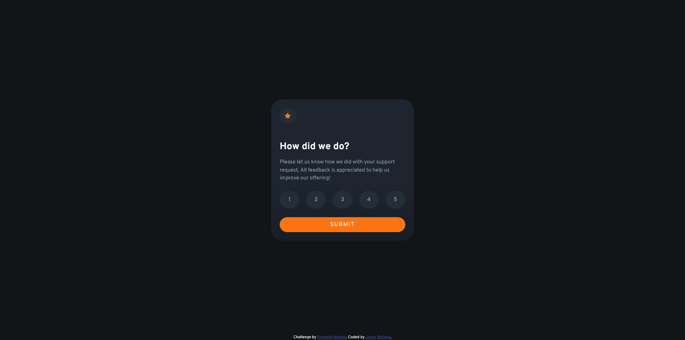

# Frontend Mentor - Interactive rating component solution

This is a solution to the [Interactive rating component challenge on Frontend Mentor](https://www.frontendmentor.io/challenges/interactive-rating-component-koxpeBUmI). Frontend Mentor challenges help you improve your coding skills by building realistic projects. 

## Table of contents

- [Overview](#overview)
  - [The challenge](#the-challenge)
  - [Screenshot](#screenshot)
  - [Links](#links)
- [My process](#my-process)
  - [Built with](#built-with)
  - [Useful resources](#useful-resources)
- [Author](#author)

## Overview

### The challenge

Users should be able to:

- View the optimal layout for the app depending on their device's screen size
- See hover states for all interactive elements on the page
- Select and submit a number rating
- See the "Thank you" card state after submitting a rating

### Screenshot

### Links

- Solution URL: [https://github.com/javierb256/Interactive-rating-component](https://github.com/javierb256/Interactive-rating-component)
- Live Site URL: [https://javierb256.github.io/Interactive-rating-component/](https://javierb256.github.io/Interactive-rating-component/)

## My process

### Built with

- Semantic HTML5 markup
- CSS
- [Bootstrap](https://getbootstrap.com/) - Bootstrap
- CSS Grid
- Javascript

### Useful resources

- [MDN querySelectorAll](https://developer.mozilla.org/en-US/docs/Web/API/Document/querySelectorAll) - This helped me see how to select all buttons on my page with a specific class. In this case I selected all buttons with a option class.
- [Stackoverflow input is empty after button is clicked](https://stackoverflow.com/questions/36257109/value-of-input-is-empty-after-button-click) - I was having an issue where my inputs were not replacing the span textContent whenver I would press the submit button. After reviewing this question I realized I was targeting every button, including the submit which did not have a value attached to it. So when I clicked the button it would return an undefined value resulting in an empty span element.

## Author

- Website - [https://javierbarrera.dev/](https://javierbarrera.dev/)
- Frontend Mentor - [https://www.frontendmentor.io/profile/javierb256](https://www.frontendmentor.io/profile/javierb256)
